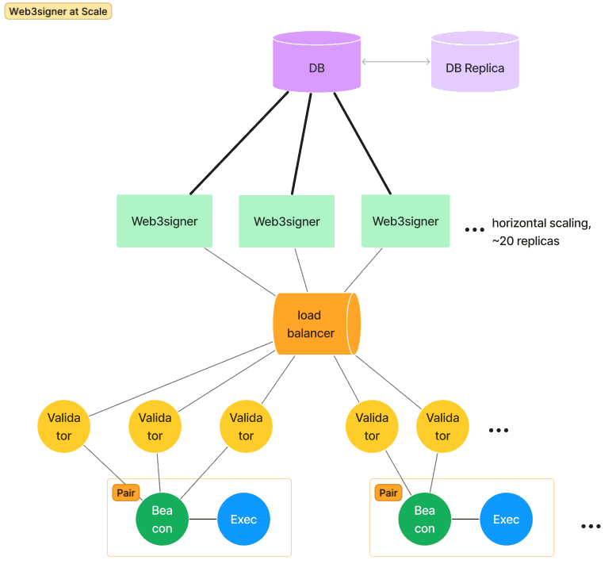

import Tabs from '@theme/Tabs';
import TabItem from '@theme/TabItem';

# Running Web3Signer at Scale

There are a few key things to be aware of when running Web3Signer at scale. If you are managing hundreds or thousands of keys, these can help with attestation performance on your validators. 

*Credit: Kiln. Architecture diagram of Web3Signer at scale*

Horizontal scale helps with request latency on Web3Signer. Connecting these instances to the same slashing database will ensure low signing latency with high safety, but there are some things to consider when configuring your environment. The majority of cost is bared at startup, with more keys causing Web3Signer to take longer to start up. This is a one time cost (per restart).

## Database Proximity

The [slashing database](./configure-slashing-protection.md) is crucial to managing many validators safely. Reducing latency and overhead on this database will greatly improve performance. 

* **Reduced Geographic Latency**: Strategically place Web3Signer instances to ensure minimal distance to the slashing protection database.
* **Performance Tuning**: Optimize database configurations for rapid access, considering factors like indexing and connection pooling.

## Threading Model Optimization

Web3Signer's threading framework, [Vertx](https://vertx.io/docs/vertx-core/java/), while powerful, is not suitable for all environments without configuration. If you are experiencing request latency or blocked threads, consider adjusting the [worker pool size](../reference/cli/options.md#vertx-worker-pool-size).

* **Concurrency Management**: Tailor the size of Web3Signer's thread pool to the expected load, preventing bottlenecks. If you see decreased attestation performance while the signing load is at its peak, increase the pool size.
* **Dynamic Adjustments**: Implement monitoring tools to adjust threads in real-time based on current demand and workload. You should measure spikes and adjust the pool accordingly. We provide two [metrics](./monitor/metrics.md) that may help here: 
    * http_vertx_worker_queue_delay: time spent by requests in queues before being processed
    * http_vertx_worker_pool_completed_total : number of queries processed by Web3Signer

## Load Balancing

At scale, you will likely need multiple instances of Web3Signer connected to a load balancer. You want to ensure a balanced distribution of requests.

* **Request Distribution**: Apply an ingress load balancer to ensure requests are evenly spread, preventing overloading of single instances. Using the same slashing database allows for replicas of Web3Signer to sign in parallel without slashing risk. 

Credit to our friends at [Kiln](https://www.kiln.fi/) for this [helpful article](https://www.kiln.fi/post/learnings-from-running-web3signer-at-scale-on-holesky).

## Hardware Recommendations

We test our nodes with 10k keys on various testnets like Goerli. In an example, we use a single cloud VM instance running Besu, Teku, and Web3Signer on an Azure Standard D8as v5 (8 vCPUs, 32 GiB memory). This may be more than needed, depending on your usage (see the example dashboard below).

The Web3Signer process alone, with 10K keys uses < 2GB of JVM heap.

Here we have assumed only one validator client connecting to Web3Signer. Multiple VCs may change requirements, although the number of requests should be the same if it's the same 10K keys partitioned across multiple clients.