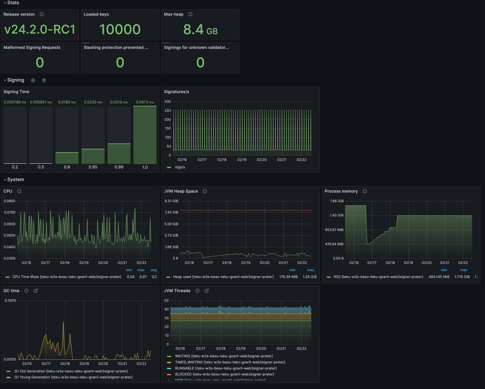

import Tabs from '@theme/Tabs';
import TabItem from '@theme/TabItem';

# Run Web3Signer at scale

When running Web3Signer at scale with hundreds or thousands of keys, several factors affect attestation performance on validators. 
Horizontal scaling reduces request latency on Web3Signer. To maintain low signing latency and high safety, connect multiple Web3Signer instances to the same slashing database.

The primary performance cost occurs during startup. More keys increase Web3Signer's startup time, representing a one-time cost per restart. 

When configuring your environment, consider the startup delay, the number of keys managed, and available system resources.

Balancing these factors optimizes system performance and responsiveness. Regular monitoring and tuning are necessary as the number of managed keys grows or network conditions change.

## Database proximity

The [slashing database](./configure-slashing-protection.md) ensures the safe management of multiple validators. Optimizing the slashing database reduces latency and overhead, improving overall system performance.

- **Reduced geographic latency**: Strategically place Web3Signer instances to ensure minimal distance to the slashing protection database.
- **Performance tuning**: Optimize database configurations for rapid access, considering factors such as indexing and connection pooling.

## Threading model optimization

Web3Signer uses [Vertx](https://vertx.io/docs/vertx-core/java/) as its threading framework. While powerful, Vertx requires proper configuration for optimal performance in different environments. If you encounter request latency or blocked threads, adjust the [worker pool size](../reference/cli/options.md#vertx-worker-pool-size).

To manage concurrency, tailor Web3Signer's thread pool size to your expected load. Increase the pool size if you observe decreased attestation performance during peak signing loads.

You can implement monitoring tools for dynamic thread adjustments based on current demand and workload. Measure spikes and adjust the pool accordingly. 

You can use the following [metrics](./monitor/metrics.md):

- `http_vertx_worker_queue_delay`: The request queue waiting time before processing.
- `http_vertx_worker_pool_completed_total`: The number of queries processed by Web3Signer.

## Load balancing

At scale, deploy multiple Web3Signer instances behind a load balancer. This setup ensures balanced request distribution.
Use an ingress load balancer to spread requests evenly across instances. This prevents overloading of single instances.
Connect all Web3Signer instances to the same slashing database. This allows parallel signing without slashing risk.

For more information, see the [Kiln article](https://www.kiln.fi/post/learnings-from-running-web3signer-at-scale-on-holesky) on running Web3Signer at scale.

## Hardware recommendations

The Web3Signer team runs nodes managing 10,000 keys on various testnets. For example, a single Azure Standard D8as v5 VM (8 vCPUs, 32 GiB memory) can host Besu, Teku, and Web3Signer simultaneously. 
Your specific use case might require less powerful hardware.

Web3Signer consumes less than 2 GB of JVM heap while managing 10,000 keys in this setup.

The test configuration connects one validator client to Web3Signer. Using multiple validator clients might change resource requirements. 
Distributing the same 10,000 keys across multiple clients maintains the total number of requests to Web3Signer.
